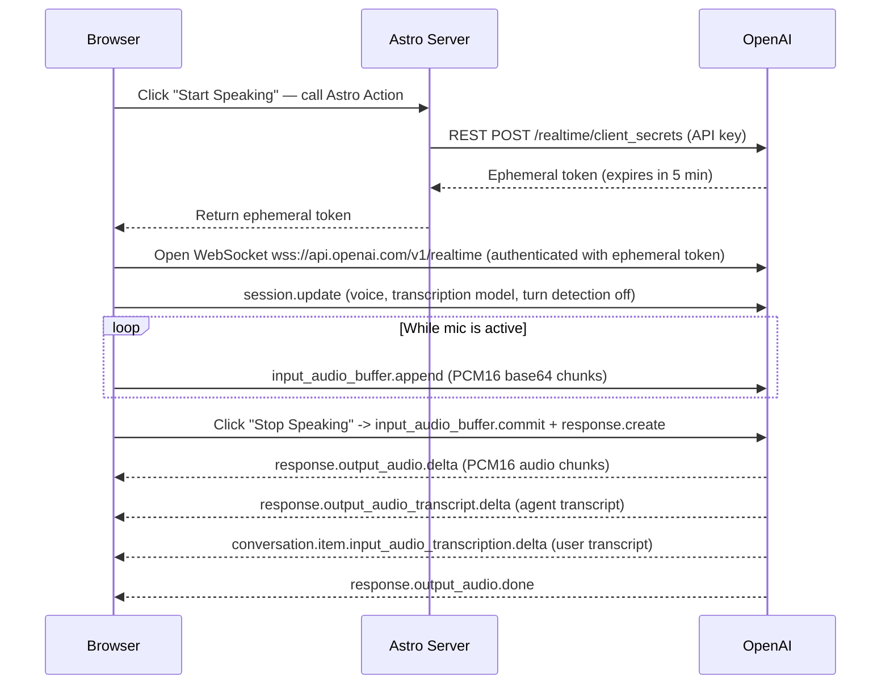

# OpenAI Realtime API — WebSocket Demo with Astro.js

A fully working demo that connects a web browser directly to the [OpenAI Realtime API](https://developers.openai.com/api/docs/guides/realtime) over a WebSocket using a short-lived **ephemeral token**. The server side is handled by **Astro.js** (on-demand rendering + Astro Actions). Everything else for example like microphone capture, audio processing, and playback is pure client side code built on modern browser APIs.

---

## How It Works



The browser never exposes the real OpenAI API key. The server mints a short-lived token (5 minutes) and hands it to the client. The client opens the WebSocket directly to OpenAI using that token.

---

## Key Features

- **Ephemeral token auth** --> real API key stays on the server; browser gets a scoped, expiring token.
- **Astro Actions** --> type safe server functions called from client code with zero boilerplate.
- **AudioWorklet** --> audio processing runs on a dedicated worklet thread so the main thread is never blocked.
- **Manual turn detection** --> microphone audio is buffered continuously and committed to OpenAI only when the user clicks **Stop Speaking**, giving full control over when a response is triggered.
- **Gapless audio playback** --> incoming PCM16 audio chunks are decoded and scheduled on a single `AudioContext` timeline, producing a smooth, uninterrupted voice response.
- **Live transcripts** --> both the user's speech and the agent's reply are streamed and displayed in real time.

---

## Tech Stack

| Layer              | Technology                                                    |
| ------------------ | ------------------------------------------------------------- |
| Framework          | [Astro.js](https://astro.build) 5.x on-demand (SSR) rendering |
| Server adapter     | `@astrojs/node` (standalone mode)                             |
| Server logic       | Astro Actions + `openai` npm SDK                              |
| Realtime transport | Native browser `WebSocket` -> OpenAI Realtime API             |
| Microphone capture | `MediaDevices.getUserMedia` (MediaStream API)                 |
| Audio processing   | `AudioWorklet` + `AudioWorkletProcessor`                      |
| Audio playback     | Web Audio API (`AudioContext`, `AudioBufferSourceNode`)       |
| Language           | TypeScript (client scripts)                                   |

---

## Project Structure

```
.
├── public/
│   └── scripts/
│       └── audioProcessor.js      # AudioWorkletProcessor: runs in a worklet thread;
│                                  #   buffers 200 ms of audio and posts Float32 chunks
│
└── src/
    ├── actions/
    │   └── index.ts               # Astro Action: calls OpenAI REST API to mint
    │                              #   an ephemeral token (client secret)
    ├── layouts/
    │   └── Layout.astro           # Base HTML shell
    ├── pages/
    │   ├── index.astro            # Landing page: link to the demo page
    │   └── openai/
    │       └── websocket.astro    # Demo UI: transcript boxes, Start/Stop buttons
    ├── scripts/
    │   ├── websocket.ts           # Entry point: orchestrates init, button wiring,
    │   │                          #   and connection teardown
    │   ├── openAiRealtime.ts      # WebSocket lifecycle, session config, and all
    │   │                          #   OpenAI Realtime event handling
    │   ├── mediaStream.ts         # Mic access, AudioWorklet setup, PCM16 encoding
    │   └── audioPlayback.ts       # Decodes incoming PCM16 chunks and schedules
    │                              #   them on an AudioContext for seamless playback
    └── styles/
        └── global.css
```

---

## Audio Pipeline

### Capture (mic -> OpenAI)

1. `getUserMedia` requests the microphone at **24 kHz, mono**, with echo cancellation and noise suppression.
2. `AudioWorkletNode` (`audioProcessor.js`) receives raw `Float32` samples from the Web Audio graph in a worklet thread, accumulates them into **200 ms buffers** (4800 samples at 24 kHz), and posts each full buffer to the main thread.
3. `floatTo16BitPCM` converts `Float32Array` -> PCM16 `ArrayBuffer`.
4. `base64EncodeAudio` encodes the PCM16 buffer to a base64 string (chunked to avoid call-stack overflow).
5. `bufferAudioData` sends an `input_audio_buffer.append` event over the WebSocket.

When the user clicks **Stop Speaking**, the stream is muted, `input_audio_buffer.commit` is sent to signal end-of-turn, followed by `response.create` to trigger a response.

### Playback (OpenAI -> speakers)

1. `response.output_audio.delta` — arrives as base64 PCM16 chunks over the WebSocket.
2. `base64ToFloat32Array` — decodes PCM16 → `Float32Array`.
3. An `AudioBuffer` is created and scheduled on the shared `AudioContext` timeline (`nextStartTime` pointer ensures consecutive chunks play seamlessly without gaps or overlaps).
4. When `response.output_audio.done` fires, the last scheduled source's `onended` handler hides the "Agent is speaking…" indicator.

---

## Getting Started

### Prerequisites

- Node.js 18+
- An OpenAI API key with access to the Realtime API

### Installation

```bash
git clone https://github.com/sanjayojha/openai-realtime-websocket.git
cd openai-realtime-websocket
npm install
```

### Environment Variables

Create a `.env` file in the project root:

```env
OPENAI_API_KEY=sk-...
```

> The key is only used server-side inside the Astro Action. It is never sent to the browser.

### Development

```bash
npm run dev
```

Open [http://localhost:4321](http://localhost:4321).

### Production Build

```bash
npm run build
node dist/server/entry.mjs
```

---

## Usage

1. Open the app and click the **OpenAI Websocket Demo** link.
2. Click **Start Speaking** and the app will:
    - Call the Astro Action to obtain an ephemeral token.
    - Open a WebSocket to `wss://api.openai.com/v1/realtime`.
    - Configure the session (voice: `cedar`, transcription model: `gpt-4o-mini-transcribe`).
    - Request microphone access and start the audio pipeline.
3. Speak your question. Your live transcript appears in the **User** panel.
4. Click **Stop Speaking**, the buffered audio is committed and sent to OpenAI.
5. The agent's voice response streams back and plays through your speakers. The agent transcript appears in the **Agent** panel simultaneously.
6. Click **Start Speaking** again for a follow-up question, or **Close Session** to tear everything down.

---

## Session Configuration

The session is configured via a `session.update` event immediately after the WebSocket opens:

| Setting                | Value                          |
| ---------------------- | ------------------------------ |
| Output voice           | `cedar`                        |
| Output audio format    | PCM16 @ 24 kHz                 |
| Transcription model    | `gpt-4o-mini-transcribe`       |
| Transcription language | `en` (with Indian accent hint) |
| Turn detection         | **disabled** — fully manual    |

Turn detection is intentionally disabled so the app has explicit control: audio is only committed and a response is only requested when the user clicks **Stop Speaking**.

---

## Dependencies

```json
{
    "@astrojs/node": "^9.5.3",
    "astro": "^5.17.1",
    "openai": "^6.22.0"
}
```

No client-side JavaScript libraries are required — everything runs on native browser APIs.

---

## License

MIT
